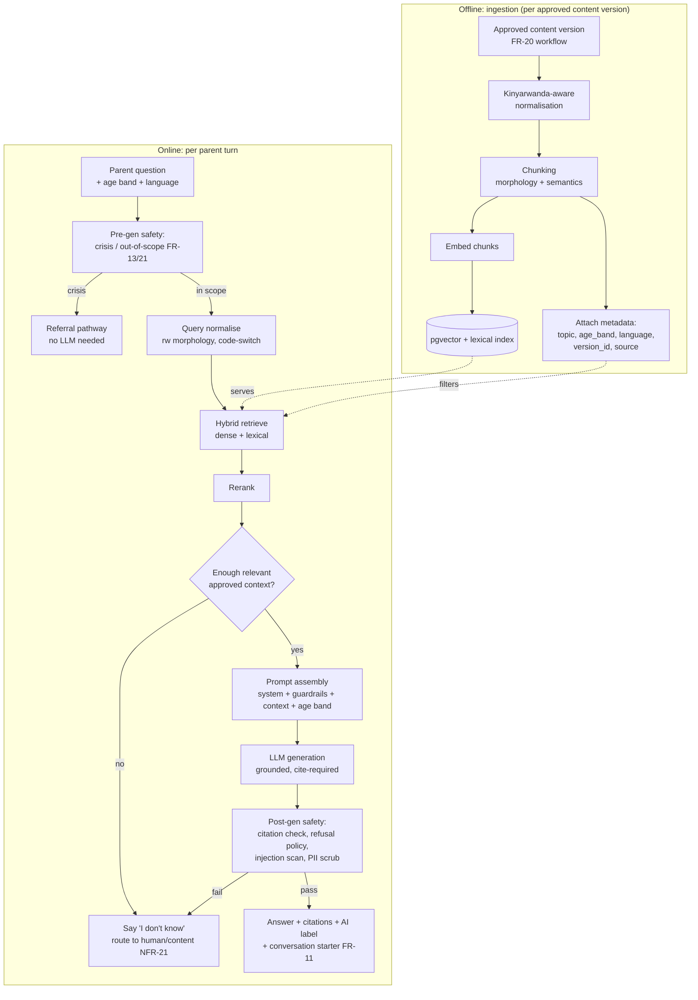

# AI Architecture — RAG Pipeline

The AI coach is a **retrieval-augmented generation** system grounded on a clinician-approved knowledge base. **No health answer comes from open generative memory** (FR-09, NFR-22, ADR-0003). This document specifies the full pipeline: ingestion → chunking → embedding → retrieval → reranking → prompt assembly → generation → post-generation safety → citation.

## Pipeline overview

## Stage-by-stage

### 1. Ingestion
- Triggered only by content reaching **`approved/published`** in the FR-20 workflow. Draft/unapproved content **never** enters the index.
- Each chunk inherits metadata: `content_version_id`, `topic`, `age_band`, `language`, `source_title`. This metadata drives filtered retrieval and citation.
- Re-ingestion on new versions; retired versions are removed from the index (traceability preserved in the DB).

### 2. Kinyarwanda-aware normalisation & chunking
- Normalisation (see `kinyarwanda-strategy.md`): morphological normalisation/lemmatisation where tooling exists; consistent orthography; expansion of key SRH synonyms/stems.
- **Chunking is semantic, not fixed-token:** split on topic/section boundaries, keeping a chunk to one coherent idea (target ~150–300 words `[tune empirically]`), because agglutinative token counts mislead fixed-size splitters. Overlap preserved for context.

### 3. Embedding & indexing
- Multilingual embeddings (candidate models benchmarked in `kinyarwanda-strategy.md`); vectors stored in **pgvector** (ADR-0002) with an HNSW index.
- A parallel **lexical index** (Postgres full-text) enables hybrid retrieval to catch exact morphological variants.

### 4. Retrieval (hybrid) + metadata filtering
- Retrieve top-k from **both** dense and lexical, filtered by `language` and `age_band` where applicable.
- Merge candidate sets (reciprocal-rank fusion `[tune]`).

### 5. Reranking
- A cross-encoder reranker scores the merged candidates for query relevance; keep top-n for the prompt. Improves precision, which improves grounding.

### 6. Grounding gate
- If reranked relevance is below a threshold, or too few approved chunks match, the system **does not generate a health answer**. It says it doesn't know and routes to curated content or a human (NFR-21). *A wrong answer is worse than "I don't know."*

### 7. Prompt assembly
- Deterministic template (versioned; stored per response as `prompt_version`, FR-15): system role + **guardrails** (`safety-and-guardrails.md`) + retrieved approved passages (with their ids) + child **age band** (FR-10) + language + channel-format instruction. **No PII** enters the prompt (ADR-0004).

### 8. Generation
- The LLM synthesises an answer **only** from the provided passages and must attach citations to the passages used. Temperature low; length bounded per channel.

### 9. Post-generation safety
Runs on every response (`safety-and-guardrails.md`):
- **Citation check:** answer must cite ≥1 provided approved passage; uncited health claims → reject → "I don't know" path (NFR-22).
- **Refusal policy:** diagnosis/prescription/termination advice → replaced with a refer-to-professional response (NFR-21).
- **Prompt-injection scan** on retrieved+user text; **PII scrub** on output.
- **Crisis re-check** as a backstop to the pre-gen check.

### 10. Citation & logging
- Response stored with `MESSAGE_SOURCE` rows linking it to the exact `content_version_id`(s) used, plus `prompt_version` (FR-15) — enabling clinical audit (P5) and the weekly human review (NFR-23).

## Latency budget (NFR-01: ≤5 s p95 app)

| Stage | Budget (p95) |
|---|---|
| Pre-gen safety + normalise | ≤150 ms |
| Hybrid retrieval | ≤300 ms |
| Rerank | ≤150 ms |
| Prompt assembly | ≤50 ms |
| LLM generation | ≤3.5 s |
| Post-gen safety + format | ≤300 ms |
| Overhead/network | ≤550 ms |
| **Total** | **≤5 s** |

SMS relaxes to 30 s and can serve pre-computed answers for common questions.

## Failure & degradation (NFR-06)
- LLM timeout/circuit-open → cached FAQ answer + referral directory + "I'll answer when I can" (queued). Retrieval/DB down → curated content + referral. **Crisis handling never depends on generation.**

## What the AI is explicitly *not* allowed to do
- Answer health questions without approved retrieved context.
- Diagnose, prescribe, or advise on termination (NFR-21).
- Store or emit PII.
- Generate content that hasn't passed through the grounding gate + citation check.

See `evaluation-framework.md` for how each guarantee is measured before release.
