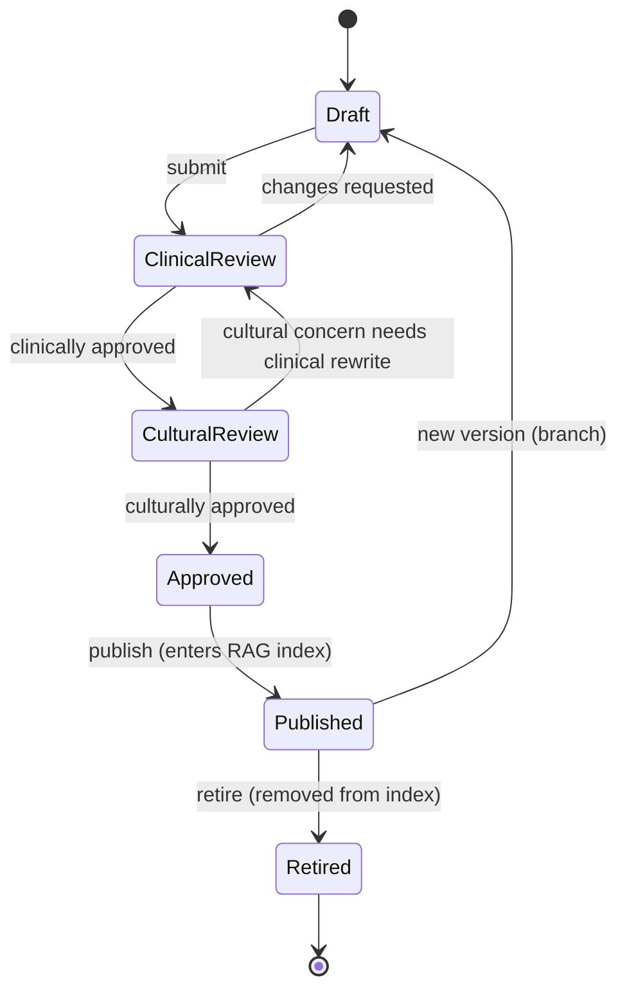

# Knowledge Base Specification

The corpus the RAG coach retrieves from. **Nothing reaches a user unapproved** (FR-20). This spec defines the structure, taxonomy, metadata, and the editorial workflow with its review gates.

## Principles

- **Clinician-approved or it doesn't exist** (to the retriever). The index contains only `approved/published` versions.
- **Traceable:** every chunk maps to a source document and a version; every AI answer cites it (FR-15, NFR-22).
- **Culturally reviewed**, not just clinically correct (NFR-24).
- **Versioned & reversible:** content can be updated or retired without code changes (FR-33, ADR-0010).

## Content item structure

Each **content item** is a coherent unit (e.g. "Talking to a 13–15-year-old about consent"). It has one or more **versions**; only approved versions publish.

```
ContentItem
 ├─ topic            (taxonomy, below)
 ├─ age_band         10_12 | 13_15 | 16_19 | all
 ├─ language         rw | en | fr
 └─ versions[]       ContentVersion (draft → … → published → retired)
       ├─ body_markdown        (the text, chunkable)
       ├─ audio_asset_uri      (required for core content, FR-19/NFR-26)
       ├─ illustration_uris[]  (optional)
       ├─ citations_external[] (source evidence: MoH/WHO/RBC guidance) [VERIFY]
       ├─ metadata (below)
       └─ approvals (clinical, cultural)
```

## Taxonomy (topics)

| Topic | Examples |
|---|---|
| `puberty_development` | Body changes, menstruation, hygiene |
| `relationships` | Friendships, dating, peer pressure |
| `consent` | What consent is, boundaries, saying no |
| `srh` | Contraception basics (educational, non-prescriptive), STIs, pregnancy facts |
| `communication` | How to start conversations, listening, non-judgement |
| `positive_parenting` | Warmth + boundaries, discipline without violence |
| `safeguarding` | Recognising risk, where to get help (feeds referral, FR-21) |
| `myths` | Correcting common misinformation |

Topics × age bands × languages form the coverage grid the pilot must fill for its MVP scope (see `mvp-scope.md`).

## Metadata schema (per version)

| Field | Purpose |
|---|---|
| `content_version_id` (uuid) | Citation target (FR-15) |
| `topic`, `age_band`, `language` | Retrieval filtering (FR-10) |
| `reading_level` | Plain-language check for low-literacy |
| `source_evidence[]` | External clinical basis (WHO/MoH/RBC) `[VERIFY]` |
| `clinical_reviewer`, `clinical_approved_at` | Accountability (FR-20) |
| `cultural_reviewer`, `cultural_approved_at` | NFR-24 |
| `status` | draft / clinical_review / cultural_review / approved / published / retired |
| `version`, `supersedes` | Versioning & rollback |
| `retention_class` | P0 (content is public/non-personal) |

## Editorial workflow (gated; nothing skips a gate)



- **Draft:** authored by content staff (non-technical via CMS, NFR-34).
- **Clinical review (P5, gate #1):** a clinician verifies accuracy and safety; **no unsafe medical content passes** (NFR-20). Blocking authority.
- **Cultural review (gate #2, NFR-24):** local advisory panel (parents, faith/community leaders, adolescents) checks appropriateness and language/euphemism.
- **Approved → Published:** only now does the content enter the RAG index (ai-architecture.md §1). Publishing is audit-logged (NFR-11).
- **Retire:** removes from the index; prior citations remain resolvable for audit.

**Enforcement:** the retriever queries only `published`. A CI/config check refuses a deploy whose content bundle references a non-published version. State transitions are permission-gated (FR-05) and audited.

## Authoring guidance

- Plain Kinyarwanda first; short sentences; audio for every core item (FR-19).
- Use the **SRH synonym/stem map** (kinyarwanda-strategy.md) so parents' euphemisms retrieve the right clinical content.
- Age-band appropriate: the same topic is authored differently for 10–12 vs 16–19 (FR-10).
- Every SRH claim carries `source_evidence` (WHO/MoH/RBC) `[VERIFY]` — the clinician checks these.

## Phase 0 dependency

If no RAG-ready corpus exists (`[ASSUMPTION Q3]`), building and approving this KB — plus the evaluation set — **is Phase 0**, before application code (see `roadmap.md`). The RAG coach is only as safe as this corpus.
