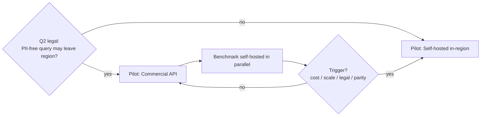

# Model Selection

Options analysis for the **generation** LLM: commercial API vs. self-hosted open model — on cost per conversation (pilot and scale), latency, and data-residency. Realises **ADR-0004**. Retrieval/embedding model selection lives in `kinyarwanda-strategy.md`.

> All monetary and latency figures below are **planning estimates `[VERIFY]`** to be replaced with measured numbers during Phase 0. They exist to make the trade-off legible, not to quote a price.

## The decision in one line

**MVP: commercial API for generation, no PII in prompts, behind a provider abstraction, with a benchmarked migration path to an in-region self-hosted open model.** Final call depends on the Q2 legal ruling (may PII-free query text leave the region for inference?).

## Options

### Option A — Commercial LLM API
- **Pros:** strongest quality now (incl. multilingual), no GPU ops, fast to a safe pilot, elastic.
- **Cons:** per-token cost recurring at scale; **cross-border inference** question (Q2/NFR-18); external availability dependency (mitigated by degradation, NFR-06); vendor pricing risk.
- **Residency handling:** send only PII-free question + retrieved approved passages + age band (ADR-0004). Personal data stays in-region; only de-identified query context transits, *if legal permits*.

### Option B — Self-hosted open model (in-region)
- **Pros:** full data residency; fixed/controllable cost; no per-token billing; independence.
- **Cons:** GPU provisioning & MLOps burden for a small team; **likely weaker Kinyarwanda** out of the box `[VERIFY]` (may need adaptation); latency depends on in-region GPU availability; you own uptime.
- **Residency handling:** everything stays in-region — cleanest compliance story.

## Comparison

| Dimension | A: Commercial API | B: Self-hosted open |
|---|---|---|
| Quality (multilingual/Kinyarwanda) | Highest now `[VERIFY on eval set]` | Model-dependent; may need adaptation |
| Data residency (NFR-18) | Needs Q2 legal OK for PII-free transit | Fully in-region ✅ |
| Ops burden (small team) | Low ✅ | High (GPU, scaling, patching) |
| Cost at **pilot** (low volume) | **Lower** (no idle GPU) ✅ | Higher (GPU runs even when idle) |
| Cost at **scale** (high volume) | Can dominate (per-token) | **Potentially lower** (amortised GPU) ✅ |
| Latency (NFR-01) | Network to provider | In-region compute, GPU-bound |
| Migration/lock-in | Abstraction limits lock-in | You control it |

**Cost intuition (not a quote):** commercial APIs win while volume is low (pay-per-use beats idle GPUs); self-hosting wins once sustained volume amortises fixed GPU cost. The crossover point is estimated in `cost-model.md` and **measured** in Phase 0. This mirrors the MVP-then-migrate recommendation.

## Cost-per-conversation model (to be measured)

`cost_per_conversation ≈ (avg_input_tokens + avg_output_tokens) × price_per_token` (Option A) — dominated by retrieved-context size, so **tighter chunks/rerank reduce cost as well as improve quality**. For Option B: `amortised_gpu_cost / conversations_per_period`. Both are tracked against the sustainability envelope (NFR-35) in `cost-model.md`.

## Recommendation & migration path

1. **Pilot on Option A** (fastest safe path), *contingent on Q2*. If legal forbids PII-free transit, **start on Option B** — the provider abstraction makes this a config choice, not a rewrite.
2. **Benchmark Option B in parallel** on the Kinyarwanda eval set (accuracy, safety, latency, cost).
3. **Migrate to Option B when** any trigger fires: cost-per-conversation breaches the envelope (NFR-35), volume passes the crossover, a legal ruling requires in-region inference, or an open model reaches parity on the eval set.

## Guardrails independent of the choice

Whichever model is used, the **grounding gate, citation requirement, refusal policy, and evaluation release gate** (`safety-and-guardrails.md`, `evaluation-framework.md`) apply identically. Safety is a property of the pipeline, not the model — so swapping models is safe *because* the gate must pass again.
