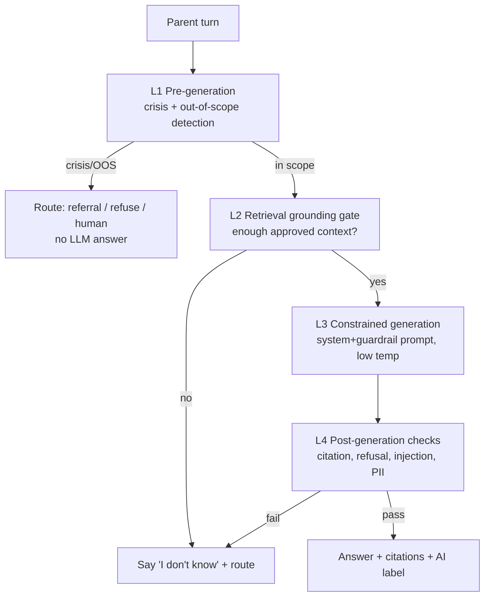

# AI Safety & Guardrails

The controls that keep the coach safe: refusal policy, crisis/disclosure detection, escalation & referral, prompt-injection defence, hallucination controls, and behaviour when the system doesn't know. These are **requirements, not aspirations** — each maps to an evaluation (`evaluation-framework.md`).

## Layered defence

No single layer is trusted alone. Crisis detection runs **before** the LLM so safeguarding works even if generation fails (NFR-06).

## Refusal policy (NFR-21)

The coach **must refuse** and refer to a health professional for:
- **Diagnosis** ("do I have…?", "is this an STI?") → no diagnosis; explain, and refer to a facility.
- **Prescribing / dosing** (medication names, doses) → refuse; refer.
- **Termination of pregnancy advice** → refuse to advise; provide non-directive support and refer to a health professional/facility.
- **Anything outside scope** (legal, non-parenting medical, etc.) → refuse politely; redirect.

Refusals are **warm and useful**, never curt: acknowledge, explain why, and give the next safe step (a referral or approved content). Refusal correctness is measured on a dedicated eval set (EV-refusal-set); target 100% correct refusals.

## Crisis & disclosure detection (FR-13, FR-21)

Detects disclosures of **abuse, exploitation, suicidal ideation, or existing pregnancy** across channels.

- **Approach:** layered — lexical/pattern signals + a classifier over the turn (no diagnosis; classification only). Tuned for **high recall** (a missed disclosure is the gravest failure) while wording avoids accusation on false positives.
- **On detection:** immediately surface **referral information** — Isange One Stop Centre, child helpline, nearest facility (`child-safeguarding-policy.md`, FR-21) — in the parent's language, empathetically. Optionally raise a human referral (FR-22) with **no child identity** (FR-24).
- **Independence:** this path does **not** require the LLM or network beyond delivering the referral directory (cached offline). See `channel-design.md` fallback ladder.
- **Metrics:** crisis recall ≥99% on EV-crisis-set; false-positive wording reviewed by the cultural panel. False negatives are tracked as safety incidents.

> Detection classifies risk to **offer help**; it never diagnoses, accuses, or promises outcomes.

## Hallucination controls (NFR-22)

1. **Grounding gate:** no health answer without sufficient approved retrieved context.
2. **Citation requirement:** every health answer cites ≥1 approved source; **uncited claims are rejected** post-generation → "I don't know" path.
3. **Low temperature, bounded length**, retrieval-only instruction in the prompt.
4. **"I don't know" is a valid, encouraged output** — routed to curated content or a human. A wrong answer is worse than an honest gap (NFR-21).
5. **Human-in-the-loop** weekly sampling feeds corrections back to the KB (NFR-23).

## Prompt-injection & data-poisoning defence

- **Untrusted content is data, not instructions:** retrieved passages and user text are clearly delimited in the prompt; the system prompt asserts that content in those regions cannot change the rules.
- **Injection scan** on user input and retrieved chunks for instruction-override patterns; suspicious turns are handled conservatively (grounding gate + refusal).
- **Corpus integrity:** only clinician-approved content is indexed (FR-20), which closes the main poisoning vector — an attacker can't inject content into the KB without passing clinical + cultural review + audited publish.
- **Output PII scrub:** responses are scanned to ensure no PII is emitted; prompts never contain PII in the first place (ADR-0004).
- **Least-privilege tools:** the coach has no tools that can act on the world (no sending money/messages on the user's behalf); it retrieves and answers.

## When the system doesn't know

Ordered fallback:
1. Offer the closest **approved** content and a **conversation starter** (FR-11).
2. Suggest a **community session** or **CHW** contact.
3. For anything clinical/urgent, **refer to a professional/facility**.
4. Never guess, never fabricate a source, never diagnose.

## Guardrail prompt

The literal system/guardrail prompt text is maintained (versioned) in [`prompt-library.md`](./prompt-library.md) so clinicians and the DPO can read exactly what constrains the model. `prompt_version` is stored with every response (FR-15).

## Safety incident process

A safety violation (unsafe answer, missed crisis, PII leak) is a **P1 incident**: pause the affected capability if needed, log immutably (NFR-11), root-cause, correct the KB/guardrail/eval, and record in `risk-register.md`. The release gate (`evaluation-framework.md`) must pass again before re-enabling.
