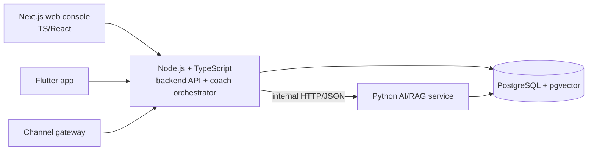

# ADR-0014 — Backend framework: Node.js (TypeScript), AI/RAG service stays Python

- **Status:** Accepted
- **Date:** 2026-07-14
- **Deciders:** Sponsor (decision), Architect
- **Supersedes:** [ADR-0001](./0001-backend-framework.md)
- **Related:** NFR-01 (latency), NFR-33 (maintainability), ADR-0011 (modular monolith), ADR-0016 (web frontend)

## Context

ADR-0001 chose Python + FastAPI for the backend, primarily to share one language with the Python-centric AI/RAG stack. The sponsor has since chosen a **JavaScript/TypeScript ecosystem** for the product: a **Node.js backend** and a Next.js/React web frontend (ADR-0016), with **Flutter** for mobile (ADR-0015). This supersedes ADR-0001.

The one genuine trade-off ADR-0001 raised was the AI/RAG ecosystem, which is strongest in Python. The sponsor's decision (recorded in `decisions-log.md`) is to **keep the AI/RAG service in Python** and build the rest in Node — getting the JS ecosystem for product code while keeping the strongest AI tooling.

## Decision

- **Backend API + orchestration:** **Node.js with TypeScript**, using a boring, well-supported HTTP framework — **NestJS** (structured, opinionated, good for a modular monolith) or Express/Fastify `[decide in Phase 1 spike]`. TypeScript is mandatory (type safety aids the data-minimisation discipline, mirroring the Pydantic rationale in ADR-0001).
- **AI/RAG service:** remains **Python** (embeddings, hybrid retrieval, reranking, evaluation — `docs/ai/`). It stays a **separately-deployable service** (already required by ADR-0011 for independent failure/scaling, NFR-06) and communicates with the Node backend over an internal HTTP/JSON API.
- **Shared contracts:** the OpenAPI spec (`openapi.yaml`) remains the source of truth; TypeScript types are generated from it so the Node backend, Next.js frontend, and Flutter app share one contract.

## Alternatives considered

| Option | Pros | Cons | Verdict |
|---|---|---|---|
| **Node/TS backend + Python AI service** | JS ecosystem for product & frontend; strongest AI tooling retained; one contract via OpenAPI | Two languages to run (but the AI service was already separate) | **Chosen** |
| Python + FastAPI (ADR-0001) | One language incl. AI | Sponsor chose JS ecosystem for product/web/mobile | Superseded |
| All-Node incl. AI/RAG | Single language | Immature Node RAG/embedding/eval tooling; higher risk on Kinyarwanda retrieval (the make-or-break) | Rejected (see decisions-log Q-tech) |

## Consequences

- Positive: unified JS/TS across backend + web + (via generated types) mobile contract; large talent pool; keeps the best-in-class Python AI/RAG stack behind a clean service boundary.
- Negative/risks: **two runtimes** (Node + Python) to build, containerise, and operate — accept the small extra ops cost; the seam is already there (ADR-0011). Keep the Node↔Python API narrow and versioned.
- Latency (NFR-01): Node's async I/O suits the channel fan-out; the LLM call still dominates the budget — unchanged from `ai-architecture.md`.
- Follow-ups: pick the concrete Node framework (NestJS vs Fastify) in a Phase-1 spike; set up OpenAPI→TS type generation; update `engineering-standards.md` tooling (ESLint/Prettier, Node test runner, coverage on core TS + Python packages).
