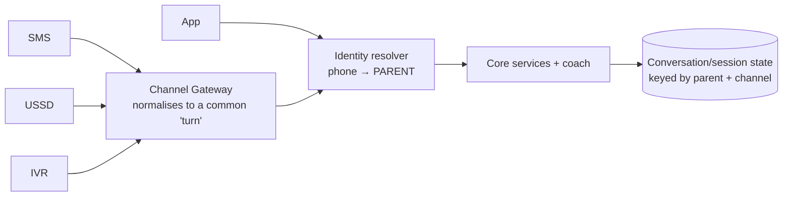
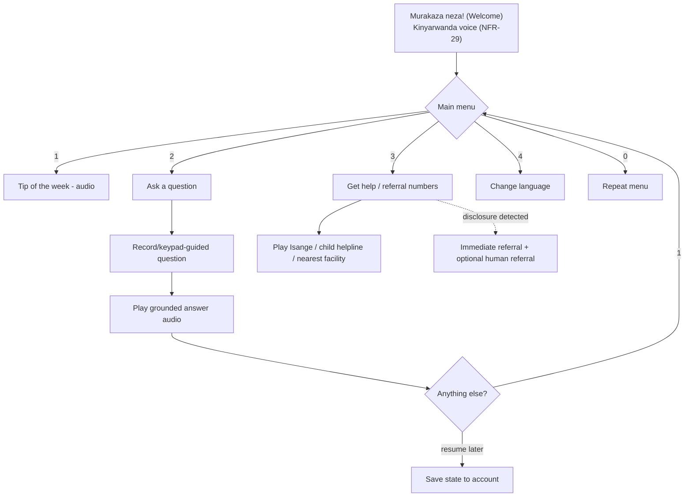
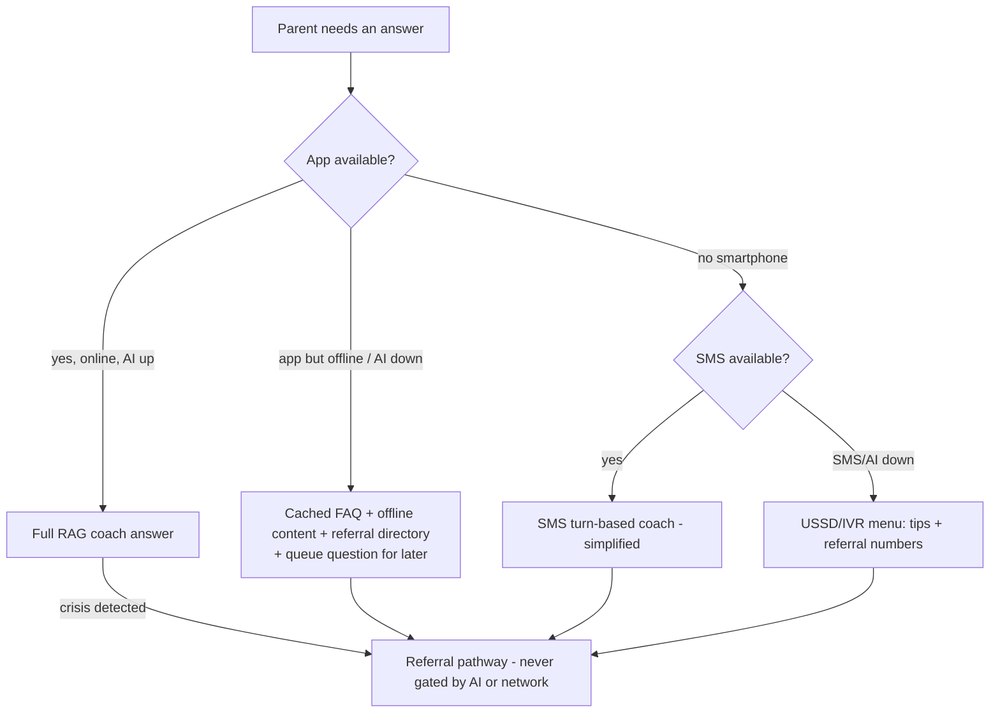

# Channel Design

How **one account** is served across app, SMS, USSD, and IVR: identity linking, session state, message-length constraints, the IVR menu tree, and the **fallback ladder** when a channel fails. (USSD/IVR are post-MVP per `mvp-scope.md`, but designed here so the abstraction is right from day one.)

## One account, many channels

The **phone number is the identity anchor** across every channel (FR-02). All channels resolve to the same `PARENT` record and profile via the Channel Gateway (ADR-0006).

- **Identity linking:** a parent who registered in the app and later texts the short code is recognised by phone number → same profile, same age bands, same language. A pseudonymous SMS user can later claim an app account with the same number.
- **Consent carries across channels** but records the channel/language it was obtained in (NFR-16).

## Session & state model

| Channel | State model | Notes |
|---|---|---|
| App | Rich client state + server conversation | Offline queue; resumes seamlessly |
| SMS | **Stateless-ish, turn-based**; server keeps last-context per number | Each inbound SMS is a turn; context window kept server-side, short-lived |
| USSD | **Ephemeral session** (~180 s); menu stack in Redis keyed by session id | Deep tasks hand off to SMS |
| IVR | Server-side call session; **resumable** via account | Interrupted call resumes, not restarts |

Coach context for SMS/IVR is deliberately **short** (last N turns) to fit latency and cost, and to limit P3 retention.

## Message-length & format constraints

| Channel | Constraint | Handling |
|---|---|---|
| SMS | 160 GSM-7 chars/segment; concatenation costs money | Coach prompted for **SMS-brevity**; long answers chunked with `Reply MORE`; links avoided (may be unusable) |
| USSD | ~182 chars/page; session timeout | Menu text terse; numbers-only navigation |
| IVR | Audio duration & attention | Pre-recorded human audio (FR-19); short prompts; barge-in allowed |
| App | Rich | Full formatting, audio, illustrations |

The coach's **channel formatter** (see `system-architecture.md` C3) renders one grounded answer into the right shape per channel — the RAG core is channel-agnostic.

## IVR menu tree (post-MVP design)

- **Prompt latency ≤1 s** after keypad input (NFR-03).
- **Toll-free** to the caller (NFR-29) — cost borne by the programme.
- `HELP` (referral numbers) is reachable in one hop and **does not depend on the AI** (NFR-06).

## Fallback ladder (when a channel or the AI fails)

The system always degrades **toward something that still helps**, never to a dead end.

**Invariant:** whatever fails, the **referral pathway and curated content remain reachable** (NFR-06). The AI is an enhancement layer on top of a system that is useful without it.

## Cross-channel edge cases

| Case | Behaviour |
|---|---|
| Same question, app then SMS | Same profile/age band; consistent grounded answer |
| Shared phone, SMS | No SRH content in unsolicited messages; sensitive replies only in response to the user's own inbound turn |
| Language switch mid-journey | `preferred_language` update applies across channels immediately (NFR-30) |
| Number recycled to a new person `[VERIFY telecom policy]` | Re-verification (OTP) + fresh consent required before serving prior context; stale history purged per retention |
