# Data Model

**Principle:** every field must justify its existence against **data minimisation** (NFR-15). If a field can't be justified, it is deleted. Each field carries a **sensitivity classification**. The system **never** stores adolescent names, national IDs, or identifiable health records (FR-24, NFR-15).

## Sensitivity classification

| Class | Meaning | Handling |
|---|---|---|
| **P0 Public/Config** | Non-personal (content, referral directory, config) | Standard |
| **P1 Operational** | Personal but low-sensitivity (district, language, channel) | Encrypted at rest; least-privilege |
| **P2 Identifier** | Directly identifies a person (phone number) | Encrypted; access-logged; minimised |
| **P3 Sensitive** | Special-category-adjacent (coach conversation content, disclosures) | Strongest controls; visible only to the user (NFR-10); short retention (NFR-19) |

## ERD

```mermaid
erDiagram
    PARENT ||--o{ CHILD_BAND : has
    PARENT ||--o{ CONSENT : gives
    PARENT ||--o{ CONVERSATION : starts
    CONVERSATION ||--o{ MESSAGE : contains
    MESSAGE ||--o{ MESSAGE_SOURCE : cites
    PARENT ||--o{ REFERRAL : subject_of
    REFERRAL ||--o{ REFERRAL_EVENT : tracks
    PARENT ||--o{ ASSESSMENT_RESULT : completes
    PARENT ||--o{ ATTENDANCE : attends
    SESSION ||--o{ ATTENDANCE : records
    USER ||--o{ AUDIT_EVENT : performs
    CONTENT_ITEM ||--o{ MESSAGE_SOURCE : referenced_by
    CONTENT_ITEM ||--o{ CONTENT_VERSION : versioned
    CAMPAIGN ||--o{ NUDGE : schedules

    PARENT {
        uuid id PK
        string phone_hash "P2 - hashed/encrypted; nullable if pseudonymous"
        string display_alias "P1 - optional, NOT real name required (FR-04)"
        string district "P1"
        string sector "P1"
        enum urban_rural "P1"
        enum caregiver_gender "P1 - for disaggregation (FR-31)"
        enum preferred_language "P1"
        enum preferred_channel "P1"
        timestamp created_at
    }
    CHILD_BAND {
        uuid id PK
        uuid parent_id FK
        enum age_band "P1 - 10_12 | 13_15 | 16_19 ONLY. No name/DOB/ID (FR-24)"
    }
    CONSENT {
        uuid id PK
        uuid parent_id FK
        string purpose "P0"
        enum language "P1 - language consent was given in (NFR-16)"
        enum method "app | sms | ivr | assisted"
        timestamp given_at
        timestamp withdrawn_at "nullable"
    }
    CONVERSATION {
        uuid id PK
        uuid parent_id FK
        enum channel
        timestamp started_at
        timestamp purge_after "P3 - retention (NFR-19)"
    }
    MESSAGE {
        uuid client_id "idempotency (offline)"
        uuid id PK
        uuid conversation_id FK
        enum role "parent | coach"
        text body "P3 - sensitive; encrypted; short retention"
        enum safety_flag "none | crisis | out_of_scope | refused"
        string prompt_version "for audit (FR-15)"
        timestamp created_at
    }
    MESSAGE_SOURCE {
        uuid id PK
        uuid message_id FK
        uuid content_version_id FK "the APPROVED source used (FR-15, NFR-22)"
        float score
    }
    REFERRAL {
        uuid id PK
        uuid parent_id FK "the ADULT raising/subject; NEVER a child identity (FR-24)"
        enum category "abuse | exploitation | self_harm | pregnancy | other"
        enum status "raised | acknowledged | actioned | closed (FR-23)"
        uuid assigned_officer_id FK
        timestamp created_at
        timestamp due_by "SLA (D2)"
    }
    REFERRAL_EVENT {
        uuid id PK
        uuid referral_id FK
        enum to_status
        uuid actor_id FK
        text note "P3 - minimal; no child identity"
        timestamp at
    }
    ASSESSMENT_RESULT {
        uuid id PK
        uuid parent_id FK
        enum assessment "baseline | followup"
        jsonb scores "P1 - knowledge/confidence/communication (FR-29)"
        timestamp completed_at
    }
    SESSION {
        uuid id PK
        uuid facilitator_id FK
        string district
        string sector
        enum topic
        timestamp scheduled_at
        enum sync_state "offline-first (FR-27)"
    }
    ATTENDANCE {
        uuid client_id
        uuid id PK
        uuid session_id FK
        uuid parent_id FK "links session to profile (FR-28)"
        timestamp recorded_at
    }
    USER {
        uuid id PK
        enum role "parent|chw|champion|school|cpo|admin|reviewer (FR-05)"
        string phone_hash "P2"
        timestamp created_at
    }
    AUDIT_EVENT {
        uuid id PK "append-only (NFR-11)"
        uuid actor_id FK
        string action
        string entity
        jsonb metadata "no P3 content bodies"
        timestamp at
    }
    CONTENT_ITEM {
        uuid id PK
        enum topic
        enum age_band
        enum language
    }
    CONTENT_VERSION {
        uuid id PK
        uuid content_item_id FK
        int version
        enum status "draft|clinical_review|cultural_review|approved|published|retired (FR-20)"
        text body "P0"
        string audio_asset_uri "FR-19"
        uuid approved_by FK "clinician (FR-20)"
        timestamp published_at
    }
    CAMPAIGN {
        uuid id PK
        enum segment_age_band
        enum segment_language
        enum channel "sms|push"
    }
    NUDGE {
        uuid id PK
        uuid campaign_id FK
        text body
        timestamp send_at
    }
```

## Field-by-field minimisation justifications (highlights)

| Field | Why it exists | Why not more |
|---|---|---|
| `PARENT.phone_hash` | Account identity, OTP, SMS/IVR delivery | Stored **hashed/encrypted**; used as identifier, not displayed; nullable for pseudonymous use |
| `PARENT.display_alias` | Friendly greeting; optional | **Real name never required** (FR-04); nullable |
| `PARENT.district/sector/urban_rural` | Referral routing + mandated disaggregation (FR-31) | Sector granularity only — **no village/cell**, no address |
| `PARENT.caregiver_gender` | Funder/MoH disaggregation (FR-31) | Optional; self-declared; not used for logic |
| `CHILD_BAND.age_band` | Age-tailored responses (FR-10) | **Band enum only** — no name, DOB, ID, or count-of-children detail beyond bands |
| `MESSAGE.body` (P3) | The coaching conversation | Encrypted; visible only to the user (NFR-10); auto-purged (NFR-19); anonymised before analytics |
| `REFERRAL.*` | Safeguarding tracking (FR-23) | Subject is the **adult**; no child identity ever (FR-24); notes minimal |
| `AUDIT_EVENT` | Immutable accountability (NFR-11) | Stores actions/metadata, **never** P3 message bodies |

## Deliberately **absent** fields (and why)

- ❌ Adolescent name / DOB / national ID / school — **prohibited** (FR-24, NFR-15). Only age *band*.
- ❌ Home address / GPS — not needed; sector suffices for routing.
- ❌ Parent national ID — not needed for the service; phone suffices.
- ❌ Health records / diagnoses — the system educates and refers; it does not hold records.
- ❌ Free-text "child details" notes on referrals — structural refusal to create an identity backdoor.

## Retention (see `retention-schedule.md`)

- P3 conversation content: retained ≤ policy window, then deleted; `CONVERSATION.purge_after` drives an automated job (NFR-19).
- Analytics run on **anonymised, aggregated** derivations only.
- Users may export/delete their data (NFR-17); deletion cascades to P2/P3 and tombstones the parent record.
