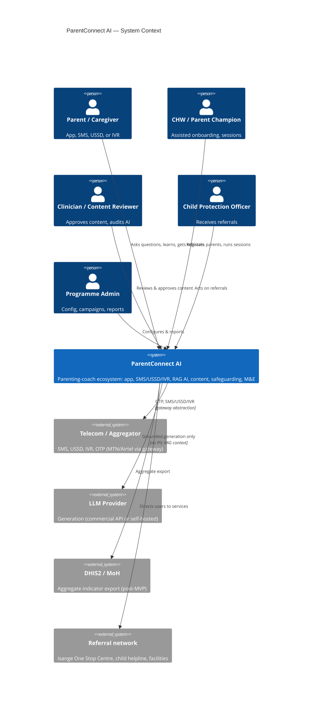
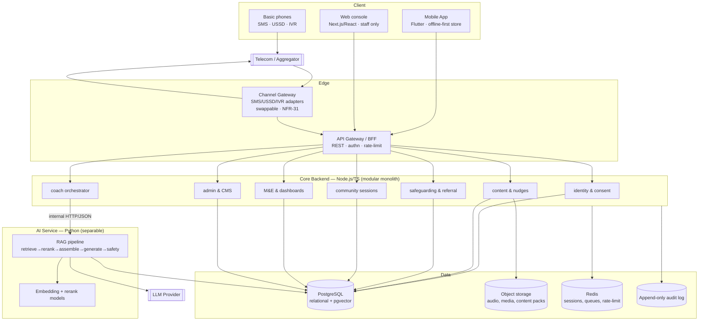
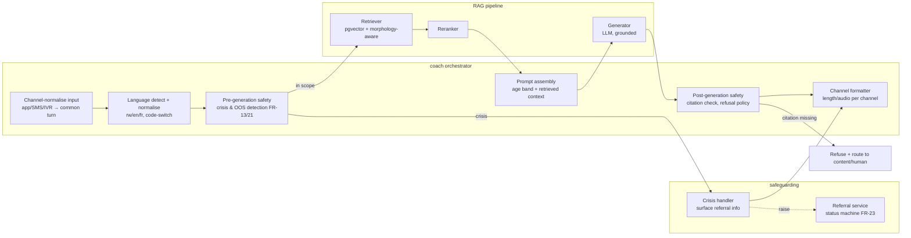

# System Architecture

**Model:** C4 (Context → Container → Component). Diagrams are Mermaid. Every significant technology choice is justified against the project constraints and cross-referenced to an ADR; rejected options are recorded there.

## Guiding constraints (from `CLAUDE.md`)

RAG-only AI · Kinyarwanda-first retrieval · safeguarding as core · Law 058/2021 data minimisation & residency · offline-first/low-bandwidth · graceful degradation when AI is down · small team, small budget → **boring, managed technology**.

---

## C1 — System context

---

## C2 — Containers

**Why a modular monolith, not microservices (ADR-0011):** a small team ships and operates a well-structured monolith far more cheaply than a fleet of services. Modules have clear boundaries so a hot path (the AI service) can be **split out** when scale demands — and it already is logically separate, because it must fail independently (NFR-06).

**Why the AI service is separable:** graceful degradation (NFR-06) requires that content, SMS, and referral survive an AI outage. The **Node.js** coach orchestrator calls the **Python** AI service over an internal HTTP/JSON API with a strict timeout and a fallback path (cached FAQ + "I'll answer when I can"). This service boundary is also the language boundary (ADR-0014): product code is TypeScript, the RAG/eval stack is Python.

---

## C3 — Components (coach + safeguarding hot path)

**Pre-generation crisis detection runs before retrieval/LLM** so a disclosure surfaces referral info even if retrieval or the LLM fails — safeguarding does not depend on the AI being healthy.

---

## Technology choices (summary; full rationale in ADRs)

| Concern | Choice | Why (constraint) | ADR | Rejected |
|---|---|---|---|---|
| Backend framework | **Node.js + TypeScript** | JS/TS ecosystem across backend + web + shared API contract; async I/O for channel fan-out | ADR-0014 (supersedes 0001) | Python/FastAPI, all-Node incl. AI |
| Web frontend (staff) | **Next.js + React + TypeScript** | Shares TS + OpenAPI types with backend; SSR; mature admin-dashboard patterns | ADR-0016 | React+Vite, Vue/Nuxt |
| Database | **PostgreSQL** | One durable, boring datastore for relational + JSON + vectors; managed offerings everywhere | ADR-0002 | MySQL, MongoDB |
| Vector store | **pgvector in Postgres** | Avoids a second datastore for a small team; pilot corpus is small; can graduate to a dedicated store later | ADR-0002 | Pinecone, Weaviate, Qdrant |
| AI approach | **RAG (no model training)** | Grounding + traceability mandatory (FR-09/NFR-22) | ADR-0003 | Fine-tuning, open-memory LLM |
| LLM provider | **Commercial API for MVP, no PII, with self-host migration path** | Fastest safe path; residency handled by input minimisation; portability kept | ADR-0004 | Self-host from day 1, single-vendor lock-in |
| Embeddings/retrieval | **Multilingual embeddings + Kinyarwanda-aware layer** | Retrieval quality on an agglutinative language is the make-or-break | ADR-0005, C2 | English-only embeddings |
| Channel gateway | **Adapter abstraction over an aggregator (e.g. Africa's Talking)** | Swappable per NFR-31; avoid telecom lock-in | ADR-0006 | Direct per-operator integration |
| IVR platform | **Aggregator/telephony voice API (post-MVP)** | Defer cost; keep behind the gateway | ADR-0007 | Build own telephony |
| Hosting | **In-region (Rwanda / approved African region)** | Law 058/2021 residency (NFR-18) | ADR-0009 | US/EU-only regions |
| Offline sync | **Local store + queued sync + typed conflict resolution** | Offline-first is a hard constraint (NFR-07) | ADR-0008 | Online-only |
| Repo layout | **Monorepo** | One small team, atomic cross-cutting changes | ADR-0012 | Polyrepo |
| Mobile app | **Flutter (Dart)** | One codebase + iOS path; offline-first via Drift/sqflite + workmanager. **APK-size (NFR-28) is tight — validate early** | ADR-0015 (supersedes 0013) | Native Kotlin, React Native, PWA-only |
| AI/RAG service | **Python** (separate service) | Strongest RAG/embedding/eval tooling; isolated for NFR-06/scale | ADR-0011/0014 | All-Node AI (immature tooling) |

---

## Meeting the non-functionals

- **NFR-01 latency:** coach path budgets — retrieval ≤300 ms, rerank ≤150 ms, LLM ≤3.5 s, overhead ≤1 s → ≤5 s p95 app. SMS path relaxes to 30 s and may pre-generate common answers.
- **NFR-04 scale:** stateless API behind a load balancer; Postgres read replicas; Redis for sessions/queues; AI service horizontally scalable. Pilot targets 10k concurrent on modest managed instances; the 500k path adds read replicas, a dedicated vector store, and queue-based async coach for SMS.
- **NFR-05/06 resilience:** health checks, timeouts, circuit breaker around the LLM; degraded mode serves content + referral + SMS. Multi-AZ where the region supports it.
- **NFR-08 DR:** daily automated Postgres backups + object-storage versioning; documented restore drill (RPO 24 h / RTO 4 h).
- **NFR-09/10/11 security:** TLS everywhere, AES-256 at rest, role-based authz at the API gateway, append-only audit log (see `security-design.md`).
- **NFR-36 portability:** all district/country specifics (language pack, referral directory, content pack, campaign schedule) are **configuration/data**, never code.

## Open architectural risks

- **Kinyarwanda retrieval quality** is the top technical risk (see `kinyarwanda-strategy.md`). If multilingual embeddings underperform, retrieval — and therefore grounding — degrades. Mitigation: evaluation-first sequencing (Phase 0) and a morphology-aware retrieval layer.
- **LLM residency vs capability tension** (ADR-0004): the best models are offshore; residency may force a weaker in-region model. Mitigation: strict input minimisation + a benchmarked migration path.
- **Telecom dependency** (Q5): SMS/USSD/IVR economics and reliability are outside our control; the gateway abstraction limits but doesn't remove this risk.
