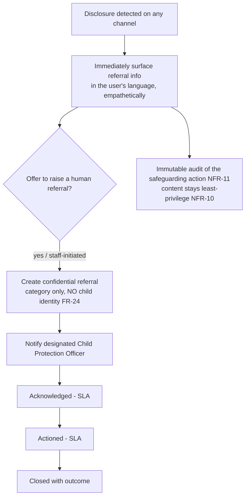

# Child Safeguarding Policy

Safeguarding is a **core function, not a feature** (`CLAUDE.md` constraint #3). The system will receive disclosures of abuse, exploitation, suicidal ideation, and existing pregnancies. This policy defines principles, the disclosure-handling protocol, reporting obligations, the referral directory, conduct rules, and the escalation SLA.

## Principles

1. **The child's safety and best interests come first**, always, over product, data, or programme concerns.
2. **Do no harm:** the system refers to qualified services; it does not attempt to counsel, diagnose, or investigate.
3. **Privacy without a backdoor:** a referral pathway **never requires a child's name or identity** (FR-24). Safeguarding and data minimisation are not in tension here — both are upheld.
4. **Always available:** referral information is reachable even when the AI or network is down (NFR-06), across every channel.
5. **Believe and support:** responses are empathetic and non-judgemental; the goal is to connect a person to help.

## What triggers safeguarding handling

Disclosures (explicit or implied) of: **abuse** (physical/sexual/emotional), **exploitation** (incl. trafficking, transactional sex), **suicidal ideation / self-harm**, or an **existing pregnancy** in an adolescent. Detection is described in `safety-and-guardrails.md` (tuned for high recall).

## Disclosure-handling protocol

- **Immediate step (automated, always):** show Isange One Stop Centre, child helpline, and nearest health facility for the user's district.
- **Human referral (FR-22):** a parent, CHW, or Champion can raise a referral; it carries **category and minimal context only** — never a child's identity.
- **Tracking (FR-23):** raised → acknowledged → actioned → closed, each with timestamp + responsible actor, against the SLA below.
- **Confidentiality:** referral content is visible only to the assigned officer and least-privilege roles (NFR-10).

## Escalation SLA `[VERIFY against national child-protection norms]`

| Category | Acknowledge within | Action within |
|---|---|---|
| Imminent danger (active abuse, suicidal intent) | **1 hour** | Immediate escalation to Isange/police/helpline |
| Abuse / exploitation (non-imminent) | 24 hours | 72 hours |
| Existing pregnancy (support/referral) | 24 hours | 5 working days |
| Other welfare concern | 48 hours | As appropriate |

Overdue referrals are flagged automatically (`REFERRAL.due_by`) and escalated to the programme safeguarding lead.

## Referral directory `[VERIFY V2 — confirm current numbers/facilities]`

| Service | Role | Contact |
|---|---|---|
| **Isange One Stop Centre** | Medical, psychosocial, legal, police support for GBV/child abuse survivors | `[VERIFY: per-district locations & numbers]` |
| **National child helpline** | Immediate child-protection support line | `[VERIFY: number]` |
| **Nearest health facility** | Clinical care & onward referral | From per-district directory (ADR-0010) |
| **NCDA / local child-protection structures** | Statutory child protection | `[VERIFY]` |

The directory is **configuration/data** per district (ADR-0010), kept current by admins (FR-33), validated non-empty before any deploy, and cached offline (never allowed to be unavailable).

## Mandatory reporting obligations `[VERIFY legal]`

- Rwandan law may impose duties to report certain child-protection concerns to authorities. The programme must confirm the exact obligations and encode them into the SLA and officer procedures. `[VERIFY]`
- Staff/volunteers are trained on when a concern **must** be escalated beyond the app to statutory services.

## Staff & volunteer conduct

- CHWs, Champions, reviewers, and officers sign a **code of conduct** `[VERIFY]`; vetting per programme policy.
- No adult may use the system to obtain a child's identity or contact — the system structurally prevents this (FR-24).
- Suspected staff/volunteer misconduct is itself a safeguarding escalation.

## Governance

- A named **safeguarding lead** owns this policy and the SLA.
- Every safeguarding action is auditable (NFR-11); the AI-ethics/advisory review (NFR-24, `ai-ethics-review.md`) reviews safeguarding UX for cultural safety.
- Safety incidents follow the process in `safety-and-guardrails.md` and are logged in `risk-register.md`.
