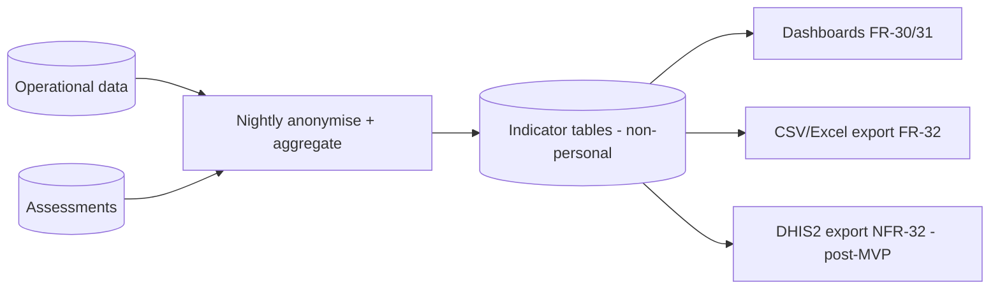

# Monitoring & M&E

Two layers: **technical observability** (is the system healthy?) and **programme M&E** (is the programme working?). Both must respect data minimisation — dashboards run on aggregates, never individual P3 content.

## Technical observability

| Concern | Signals | Target |
|---|---|---|
| Availability (NFR-05) | Uptime per service, health checks | 99.5% monthly |
| Latency (NFR-01) | p50/p95 coach (app & SMS), API, retrieval, LLM | ≤5 s app / ≤30 s SMS p95 |
| Degradation (NFR-06) | AI circuit-breaker state, fallback rate | Fallbacks serve content+referral |
| Errors | Error rate by endpoint/channel; gateway delivery failures | Alert thresholds |
| Cost (NFR-35) | LLM tokens/cost, SMS/IVR volume | Within envelope (`cost-model.md`) |
| Sync health | Queue depth, conflict rate, sync failures | Bounded |
| Security | Auth failures, authz violations, secret-scan alerts | Investigated |
| **Safety** | Crisis-flag rate, refusal rate, "I don't know" rate, citation-coverage, HITL findings | Watched as safety KPIs |

- **Alerting** on availability, error spikes, cost caps, and **safety anomalies** (e.g. sudden drop in crisis flags could mean a detection regression).
- Logs **never contain P3 content bodies** (security-design.md); observability uses metrics and non-sensitive metadata.

## Programme M&E indicators (FR-30)

Computed from operational + assessment data, **disaggregated** by district, sector, urban/rural, caregiver gender, and channel (FR-31).

| Indicator | Definition | Source |
|---|---|---|
| **Reach** | Registered users; new registrations/period | identity |
| **Active users by channel** | Users with ≥1 meaningful action/period, per app/SMS/(IVR) | activity |
| **Module completion** | Modules completed / started | content |
| **Knowledge change** | Δ knowledge score baseline→follow-up (FR-29) | assessments |
| **Confidence change** | Δ self-rated confidence | assessments |
| **Communication change** | Δ self-reported parent–adolescent communication | assessments |
| **Session attendance** | Attendees, sessions held (FR-25/28) | sessions |
| **Referrals** | Raised / acknowledged / actioned / closed; SLA adherence | safeguarding |
| **Engagement** | Coach turns/user; nudge response; content ratings (FR-34) | activity |
| **Equity** | Reach & outcomes among low-literacy / rural / no-smartphone segments | disaggregation |

The **equity** cut matters most: the programme's purpose is served only if it reaches persona P1, not just smartphone owners.

## How indicators are computed & disaggregated

- A nightly job derives **anonymised, aggregated** indicator tables from operational data (no raw P3).
- Dashboards (FR-30) query these tables; filters/groupings implement the disaggregation dimensions (FR-31).
- Assessment deltas are per-user then aggregated; individual results are P1 and access-controlled.

## Export (FR-32 / NFR-32)

- **MVP:** anonymised, aggregated **CSV/Excel** export for funder/MoH reporting.
- **Post-MVP:** **DHIS2** export — an endpoint returning DHIS2-conformant aggregate payloads (NFR-32), mapping our indicators to the agreed DHIS2 data elements `[VERIFY: element mapping with MoH]`.
- Exports are **aggregate and anonymised** — no personal or P3 data leaves in a report.

## M&E governance

- Indicator definitions are versioned and agreed with the funder (Q8) up front so reporting is consistent.
- The baseline/follow-up instruments are validated `[VERIFY]` and administered per `test-strategy.md` field protocol.
- M&E respects consent: participation in assessments is consented; withdrawal removes future processing.
