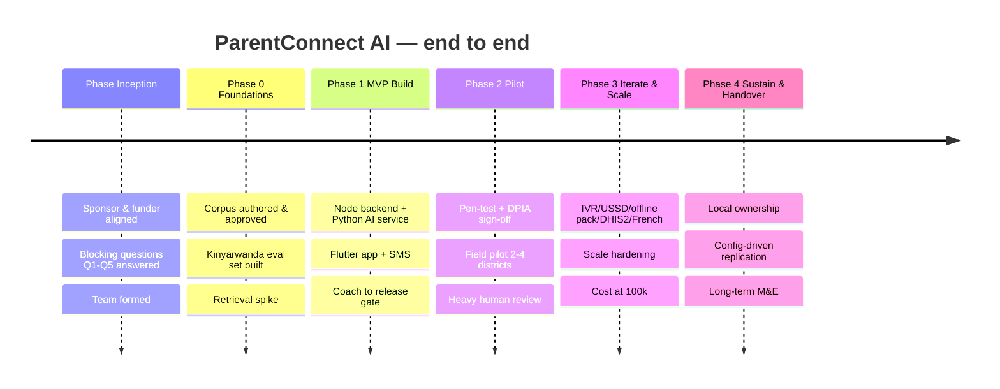
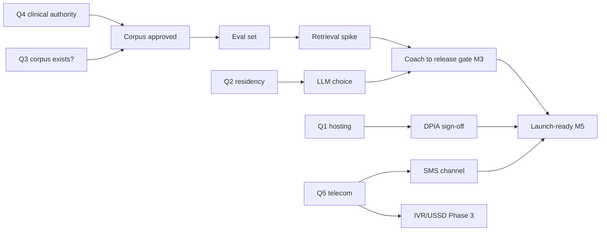

# Roadmap — Beginning to End

The full development roadmap for ParentConnect AI, from project inception through pilot, scale, and handover. **Phase 0 is knowledge base + evaluation set, not code** — this sequencing is deliberate and defended below.

**Stack (ADR-0014/0015/0016):** Node.js + TypeScript backend · Python AI/RAG service · Next.js/React web console · Flutter mobile · PostgreSQL + pgvector.

> Durations are **indicative** and depend on budget/team (Q6/Q7). The **sequence, gates, and deliverables** are the commitment — not the calendar. Nothing user-facing launches before the AI release gate (`evaluation-framework.md`) and DPIA sign-off (`data-protection-impact-assessment.md`).

---

## 1. The whole journey at a glance

## 2. Milestones (M0–M8)

| ID | Milestone | Exit signal |
|---|---|---|
| **M0** | Project chartered | Sponsor + funder aligned; blocking questions Q1–Q5 answered or owned; team formed |
| **M1** | Foundations complete | Corpus approved; eval set built (held-out slice reserved); retrieval spike clears the bar |
| **M2** | Backbone up | Node backend + Python AI service skeleton; CI/CD; auth/consent; in-region hosting live |
| **M3** | Coach passes the gate | AI release gate met on the held-out eval set (accuracy ≥95%, zero safety violations, crisis recall ≥99%, refusals 100%) |
| **M4** | MVP feature-complete | App + SMS, content+nudges+audio, safeguarding+referral, sessions, M&E + CSV |
| **M5** | Launch-ready | Pen-test criticals closed; DPIA signed; degradation/offline verified; field-test blockers cleared |
| **M6** | Pilot proven | Knowledge/confidence gain shown, disaggregated; zero unresolved safety incidents; SLA met |
| **M7** | Scale-ready | IVR/USSD/offline pack/DHIS2/French as funded; cost within envelope at target scale |
| **M8** | Sustained & handed over | Local ownership; replication by config; long-term M&E and governance running |

---

## 3. Workstreams (run in parallel, gated together)

| Workstream | Owner | Spans |
|---|---|---|
| **Knowledge & Clinical** (corpus, approvals, cultural review) | Clinical lead + advisory panel | Phase 0 → ongoing |
| **AI/RAG** (Python service, retrieval, eval, guardrails) | AI lead | Phase 0 → ongoing |
| **Backend** (Node/TS API, orchestrator, integrations) | Eng lead | Phase 1 → ongoing |
| **Mobile** (Flutter app, offline) | Mobile lead | Phase 1 → ongoing |
| **Web** (Next.js staff consoles) | Frontend lead | Phase 1 → ongoing |
| **Channels** (SMS/USSD/IVR gateway, telecom) | Eng + Programme | Phase 1 (SMS) → Phase 3 (IVR/USSD) |
| **Compliance & Safeguarding** (DPIA, security, consent, referral) | DPO + Safeguarding lead | Inception → ongoing |
| **M&E & Programme** (indicators, sessions, field ops) | Programme lead | Phase 0 → ongoing |
| **Platform/DevOps** (hosting, CI/CD, observability, DR) | Eng lead | Phase 1 → ongoing |

---

## 4. Phase detail

### Phase Inception — Charter & unblock (before any build)

**Goal:** remove the ambiguity that would otherwise be invented. **Deliverables:**
- Answers (or named owners) for blocking questions **Q1 hosting, Q2 LLM residency, Q3 corpus, Q4 clinical authority, Q5 telecom** (`decisions-log.md`).
- Funder reporting requirements & indicator set agreed (Q8).
- Team formed; roles per §3; advisory panel and clinical reviewer named.
- Data-processing agreements initiated (hosting, aggregator).

**Gate → Phase 0:** Q3 (corpus path) and Q4 (clinical authority) resolved — without these, Phase 0 cannot start.

### Phase 0 — Foundations (no application code)

**Why not code:** in a RAG system the **corpus and evaluation set are the product's safety** (ADR-0003). Building the app first means an engine with no fuel and no brakes — a coach you cannot prove is safe, which for minors' SRH is worse than nothing. The release gate cannot be met, and the system cannot launch, without Phase 0.

**Deliverables:**
- **Knowledge base authored and approved** through the gated workflow (`knowledge-base-spec.md`): topics × age bands × {Kinyarwanda, English}, with audio; clinical + cultural sign-off.
- **Kinyarwanda evaluation set** of real parent questions with expert answers (`evaluation-framework.md`), incl. crisis/refusal/out-of-scope/adversarial cases; held-out slice reserved.
- **SRH synonym/stem map** and Kinyarwanda normalisation approach (`kinyarwanda-strategy.md`).
- **Retrieval spike:** benchmark embedding models + hybrid retrieval + reranker on the eval set (recall@k, MRR) in the Python AI service — pick the simplest option that clears the bar.
- Partner confirmations (Digital Umuganda / Mbaza / Common Voice) `[VERIFY]`.

**Gate → Phase 1 (M1):** corpus approved; eval set built + held-out reserved; retrieval spike clears the retrieval bar; reviewers & key partners confirmed.

### Phase 1 — MVP Build

Scope = the MVP cut (`mvp-scope.md`): app + SMS, RAG coach (rw+en), content+nudges+audio, safeguarding+referral, community sessions, baseline/follow-up + dashboards + CSV — all privacy/AI-safety NFRs.

**Sub-tracks & order:**
1. **Backbone (M2):** monorepo scaffold (`/backend` Node, `/ai` Python, `/web`, `/mobile`); CI/CD with the gates in `engineering-standards.md`; in-region hosting (ADR-0009); PostgreSQL + pgvector; identity + OTP + **consent** flows; audit log; secrets management.
2. **AI coach to the gate (M3):** Python RAG service (retrieve→rerank→assemble→generate→safety), grounding gate, citation, refusal policy, crisis detection; **run the release gate** on the held-out set. *This is the critical path.*
3. **Product surfaces (M4):** Node orchestrator + channel gateway (SMS adapter); Flutter app (offline-first; **validate APK <25 MB, NFR-28**); content + nudges + audio; safeguarding + referral console (web); community-session tooling; M&E + dashboards + CSV export; Next.js staff consoles (admin, clinical review, CPO).

**Gate → Phase 2 (M5):** release gate met; pen-test criticals closed (NFR-12); DPIA signed (NFR-14); degradation (NFR-06) & offline (NFR-07) tested; consent flows validated; field-test blockers cleared.

### Phase 2 — Pilot

**Deliverables:**
- Security **pen-test** + remediation; **DPIA sign-off**; supervisory-authority registration (NFR-14).
- **Field testing** with real low-literacy users on real devices/networks (`test-strategy.md`).
- **Field pilot** in 2–4 districts (Q9) with **heavy human-in-the-loop review** (NFR-23) — a supervised learning period, not fire-and-forget.
- Baseline → follow-up assessment cycle (FR-29); disaggregated indicators (FR-30/31); funder reporting via CSV.

**Gate → Phase 3 (M6):** measurable, disaggregated knowledge/confidence gain; **zero unresolved safety incidents**; safeguarding SLA met; cost tracked within envelope (NFR-35).

### Phase 3 — Iterate & Scale-ready

**Deliverables (as funded / as partnerships land):**
- **IVR** (ADR-0007) + **USSD** once telecom/short-code secured (Q5); **offline content pack** (FR-18); **DHIS2 export** (NFR-32) with MoH mapping; **French** (NFR-30).
- **Scale hardening:** read replicas, queue-based async coach for SMS, dedicated vector store if the corpus outgrows pgvector (ADR-0002), load test toward the 500k path (NFR-04).
- **Cost at 100k** modelled and validated; Option A→B LLM migration if triggered (`model-selection.md`).

**Gate → Phase 4 (M7):** deferred features delivered where funded; cost within envelope at target scale; scale tests pass.

### Phase 4 — Sustain & Handover

**Deliverables:**
- **Local ownership:** operations, content editing (CMS, NFR-34), and safeguarding run by in-country staff; runbooks; training.
- **Config-driven replication** to a new district/country by configuration, not code (NFR-36, ADR-0010).
- **Long-term M&E** and governance (advisory panel, clinical review, annual pen-test NFR-12, annual DPIA review).
- Sustainability plan tracked against the funding envelope (NFR-35).

**End state (M8):** a system that runs for years on a small budget, owned locally, replicable by config, with safety and privacy governance embedded.

---

## 5. Phase gates (summary)

| Gate | Must be true |
|---|---|
| Inception → 0 | Q3 corpus path + Q4 clinical authority resolved |
| 0 → 1 (M1) | Corpus approved; eval set + held-out ready; retrieval spike clears bar; partners confirmed |
| 1 → 2 (M5) | Release gate met; pen-test criticals closed; DPIA signed; degradation & offline tested; consent validated |
| 2 → 3 (M6) | Knowledge/confidence gain shown; zero unresolved safety incidents; SLA met; cost tracked |
| 3 → 4 (M7) | Funded deferred features shipped; cost within envelope at scale; scale tests pass |

**No gate is skipped for schedule.** The stop-the-line triggers (`ai-ethics-review.md`) apply throughout: under safety uncertainty, pause — don't push on.

## 6. Critical path & dependencies

**The whole timeline hangs on Q3+Q4 (corpus + clinical authority).** Q5 (telecom) gates SMS at launch and IVR/USSD at scale. Q1/Q2 (hosting + residency) gate the DPIA and the LLM choice.

## 7. Parallelism

Backend scaffolding, Flutter UI shells, web-console shells, and content authoring can proceed **in parallel** with late Phase 0 once the retrieval approach is validated — but **nothing user-facing launches before the release gate (M3) and DPIA sign-off (M5).**

## 8. RACI (condensed)

| Decision/Deliverable | Responsible | Accountable | Consulted | Informed |
|---|---|---|---|---|
| Corpus approval | Clinical reviewer | Clinical lead | Advisory panel | Eng |
| AI release gate | AI lead | Clinical lead | DPO | Sponsor |
| DPIA sign-off | DPO | Sponsor | Legal | Funder |
| Safeguarding SLA | Safeguarding lead | Sponsor | CPO, CHWs | All |
| Stack/architecture | Architect | Eng lead | Sponsor | Team |
| Launch go/no-go | Sponsor | Sponsor | Clinical/DPO/Safeguarding leads | Funder |

## 9. If the budget halves

See `mvp-scope.md` — the defensible core is **SMS + RAG coach (rw) + safeguarding + the evaluation release gate**, dropping IVR, USSD, role-play, offline pack, DHIS2, French, and in-app dashboards (export CSV instead). Never dropped: RAG grounding, content-approval workflow, safeguarding, consent, the release gate.
