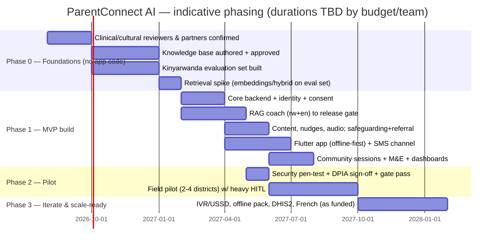

# Roadmap

A phased plan. **Phase 0 is knowledge base + evaluation set, not code** — and this sequencing is deliberate and defended below.

## Why Phase 0 is not code

In a RAG system, **the corpus and the evaluation set are the product's safety**, not the application shell (ADR-0003). You cannot build, tune, or *gate* the coach without:
- an approved corpus to retrieve from (`knowledge-base-spec.md`), and
- a Kinyarwanda evaluation set with expert answers to measure against (`evaluation-framework.md`).

Writing app code first would mean building an engine with no fuel and no brakes — you'd have a chatbot you cannot prove is safe, which for minors' SRH is worse than nothing. So Phase 0 produces the two artifacts that everything else depends on, plus the foundational research (real parent questions, partner confirmations, clinical/cultural reviewers). **The release gate cannot be met without Phase 0, and the system cannot launch without the gate.**

## Phases

Durations are **indicative** and depend on budget/team (Q6/Q7) — the *sequence and gates* are the commitment, not the calendar.

## Phase gates (exit criteria)

| Gate | Must be true to pass |
|---|---|
| **Phase 0 → 1** | Corpus approved (clinical+cultural); eval set built & held-out slice reserved; retrieval spike clears a retrieval bar on the eval set; reviewers & key partners confirmed |
| **Phase 1 → 2** | Release gate met (`evaluation-framework.md`); pen-test criticals closed (NFR-12); DPIA signed (NFR-14); degradation & offline tested; consent flows validated |
| **Phase 2 → 3** | Pilot indicators show knowledge/confidence gain; zero unresolved safety incidents; safeguarding SLA met; cost tracking within envelope (NFR-35) |

**No gate is skipped for schedule.** The stop-the-line triggers (`ai-ethics-review.md`) apply throughout.

## Phase 1 scope = the MVP cut

Exactly `mvp-scope.md`: app + SMS, RAG coach (rw+en), content+nudges+audio, safeguarding+referral, community sessions, baseline/follow-up + dashboards + CSV — with all privacy/AI-safety NFRs. Deferred items land in Phase 3 as funding and partnerships (Q5) allow.

## Critical-path dependencies

- **Q4 clinical reviewer** and **Q3 corpus** gate Phase 0 — the whole timeline hangs on these.
- **Q5 telecom/aggregator** gates SMS in Phase 1 and IVR/USSD in Phase 3.
- **Q1/Q2 hosting & residency** gate the DPIA sign-off and the LLM choice.

## Parallelism

App UI, content authoring, and backend scaffolding can proceed **in parallel** with late Phase 0 once the retrieval approach is validated — but **nothing user-facing launches before the release gate and DPIA sign-off**.
