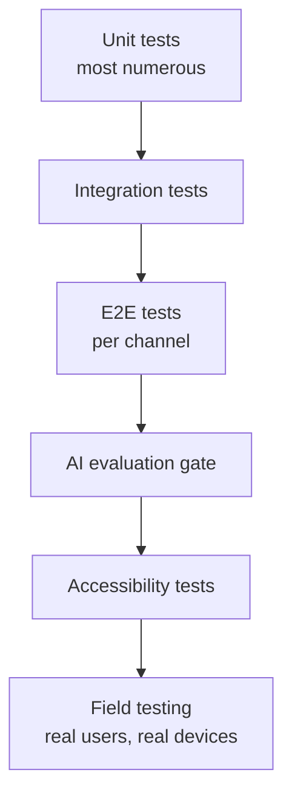

# Test Strategy

Unit, integration, E2E, AI evaluation, accessibility, and **field testing with real low-literacy users on real devices**. Test IDs (`TC-*`, `EV-*`) match the traceability matrix.

## Test levels

### 1. Unit (≥70% core coverage, NFR-33)
- Business logic: consent state, referral status machine (FR-23), offline conflict rules (ADR-0008), age-band routing, RBAC checks, content-workflow transitions (FR-20).
- Fast, deterministic, no network; fakes for gateway/LLM.

### 2. Integration
- API + DB (Postgres/pgvector), gateway adapter (fake aggregator), AI service boundary, sync endpoint.
- Degradation tests: AI service down → content/SMS/referral still respond (NFR-06, TC-ops-006).

### 3. E2E (per channel)
- **App:** register → consent → coach question → cited answer → conversation starter (J1); offline read + queue (J2); shared-phone privacy (J3).
- **SMS:** OTP → consent → Q&A turn within 30 s (J4); `STOP` opt-out.
- **Community/CHW:** assisted onboarding (J8); offline attendance → sync (J7).
- **Safeguarding:** disclosure → referral surfaced → optional referral raised → status tracked (J9) — the highest-priority E2E scenario.

### 4. AI evaluation gate (the release gate)
- `EV-*` sets run in CI on any AI-path change (`evaluation-framework.md`): retrieval (recall@k/MRR), accuracy ≥95%, **zero** safety violations, crisis recall ≥99%, refusal 100%, cultural bar, citation coverage 100%.
- Held-out slice used only for gating. Merge blocked on failure.

### 5. Accessibility & usability (NFR-25/26/27/28)
- **≤3 taps** to core tasks; task-success ≥80% in moderated tests.
- **Audio present** for all core content; screen-reader/large-text checks.
- Runs on **Android 8 / 1 GB RAM**; APK <25 MB; session <2 MB data — measured on a reference low-end device, not an emulator only.

### 6. Field testing with real low-literacy users on real devices
This is non-negotiable and easy to skip — so it's called out explicitly.
- **Who:** real parents matching persona P1 (no-smartphone/low-literacy) and P2, in pilot districts, with **informed consent** and safeguarding present.
- **What:** can they complete core tasks in Kinyarwanda by audio? Do they trust/understand the AI disclosure? Does SMS/IVR phrasing land? Is the crisis wording supportive, not alarming (cultural panel + field feedback)?
- **On real devices & networks:** low-end Android, 2G, shared phones — not lab Wi-Fi.
- **Feeds:** eval set (real questions), content revisions, and UX fixes. Findings logged; blockers gate the pilot.

## Test data & privacy

- **Synthetic data only** in dev/staging; **never** real P3 or identifiable minor data in fixtures (CONTRIBUTING.md).
- Eval question sets are curated/anonymised; real-traffic additions are anonymised (NFR-19).

## Non-functional testing

| NFR | Test |
|---|---|
| NFR-01 latency | Load test at pilot concurrency; measure p95 app & SMS |
| NFR-04 scale | Ramp to 10k concurrent; verify scaling plan |
| NFR-05 uptime | Monitored over the pilot; monthly report |
| NFR-06 degradation | Chaos: kill AI service; verify three paths (TC-ops-006) |
| NFR-07 offline | Airplane-mode capture → sync incl. conflicts (TC-ops-007) |
| NFR-08 DR | Timed restore drill vs RPO 24h/RTO 4h (TC-ops-008) |
| NFR-09/10/11 security | TLS scan, authz matrix, audit immutability (TC-sec-*) |
| NFR-12 pen-test | External test pre-launch + annual |

## CI enforcement

Unit + integration + coverage + security scans + (conditionally) the AI eval gate + config validation run on every PR to `dev` (`engineering-standards.md`). E2E and field testing run per release/phase gate.

## Traceability

Each `TC-*`/`EV-*` here corresponds to a row in `traceability-matrix.md`; adding a test keeps its ID stable.
