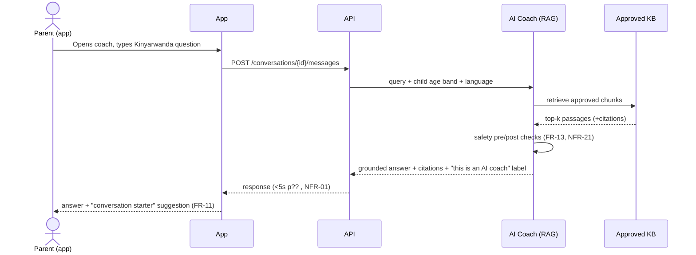
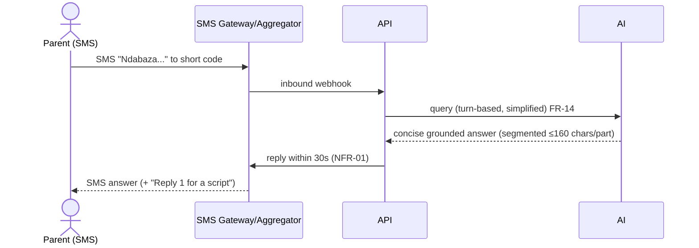
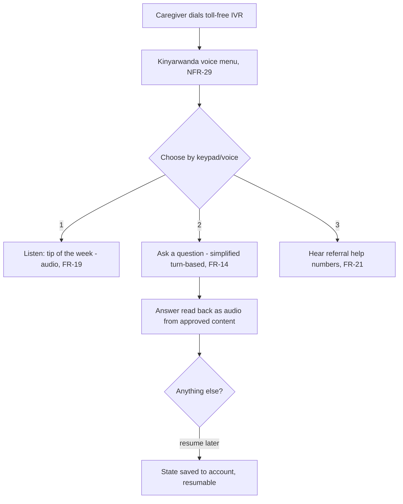

# User Journeys

End-to-end journeys per channel, including the **unhappy paths** — no network, shared phone, interrupted session, and disclosure of abuse. Unhappy paths are first-class here because they are where a safety-critical system is judged.

Legend: 🟢 happy path · 🟠 degraded/unhappy · 🔴 safeguarding-critical.

---

## J1 — App: parent asks the AI coach a hard question 🟢


- **Guarantees:** answer traces to approved source (FR-15); AI is labelled (D4); tailored to age band (FR-10).

## J2 — App unhappy: no network / AI unavailable 🟠
- Parent opens coach offline or AI service is down.
- App serves **cached offline content pack** (FR-18) and pre-computed FAQ answers; shows referral directory (works offline).
- Coach queue: message stored, sent on reconnect (offline-sync.md). Parent told plainly: *"You're offline — here's saved guidance; I'll answer your question when you reconnect."*
- **Graceful degradation (NFR-06):** curated content, SMS fallback, and referral info never depend on the AI being up.

## J3 — App unhappy: shared phone 🟠
- Multiple people use one device. Risks: someone opening the app sees prior SRH conversations.
- Design responses: optional PIN/biometric lock on the coach; **"clear conversation" one-tap**; sensitive notifications show generic text ("You have a new tip") not content; no SRH content in OS notification previews.
- User-initiated **delete history** honoured (NFR-17).

---

## J4 — SMS: Q&A on a basic phone 🟢/🟠

- 🟠 **Length constraint:** long answers are chunked and/or offer *"Reply MORE"*; the model is prompted for SMS-brevity.
- 🟠 **Airtime:** replies are toll-free/reverse-billed where arranged (Q5); otherwise minimised.

## J5 — USSD: menu-driven quick task 🟢
- Parent dials `*XXX#` → session menu: 1) Tip of the week 2) Ask a question 3) Find help 4) My language.
- Constraints: ~180s session, short pages; deep flows resume via SMS. Good for **nudable, structured** tasks, weak for free Q&A.

---

## J6 — IVR: low-literacy caregiver calls the toll-free line 🟢

- 🟠 **Interrupted call:** session state persists to the account so a call-back resumes, not restarts.
- Voice-only navigation; **prompt response <1s** on keypad (NFR-03).

---

## J7 — Community session (offline-first) 🟢/🟠
- CHW/Champion schedules a session (FR-25), gets a session guide + printable materials (FR-26).
- Runs it **offline**; records attendance and outcomes on-device (FR-27).
- On reconnect, attendance syncs and **links to each parent's profile** (FR-28) so digital + in-person channels reinforce.
- 🟠 **Conflict:** two facilitators edit the same session offline → last-writer-wins on scalar fields, union on attendance sets, flagged for review (offline-sync.md).

---

## J8 — Assisted onboarding by a CHW 🟢
- Parent cannot self-register. CHW registers them (FR-03): captures phone, district/sector, language, channel, child **age bands only** (FR-06) — **no child name/ID** (FR-24, NFR-15).
- **Consent** captured in the parent's language, read aloud if needed, and recorded (NFR-16, D4). Parent can be pseudonymous (FR-04).

---

## J9 — 🔴 Disclosure of abuse / exploitation / suicidal ideation / pregnancy

This is the journey the system exists to get right.

```mermaid
sequenceDiagram
    actor P as Parent
    participant Ch as Any channel (app/SMS/IVR)
    participant Det as Disclosure Detection
    participant Ref as Referral Service
    participant CPO as Child Protection Officer
    P->>Ch: message implying abuse / self-harm / pregnancy
    Ch->>Det: text/turn analysed (FR-21)
    Det-->>Ch: crisis classification (no diagnosis; NFR-21)
    Ch-->>P: immediate referral info: Isange One Stop Centre,<br/>child helpline, nearest facility (works even if AI down)
    Note over Ch,P: Empathetic, non-judgemental, in the user's language
    opt Human referral raised (FR-22)
        Ch->>Ref: create confidential referral (no child identity, FR-24)
        Ref->>CPO: notify designated officer
        CPO->>Ref: acknowledge → action → close (FR-23, with SLA D2)
    end
```
- **Always-on:** referral surfacing does **not** depend on the AI service (NFR-06).
- **No diagnosis, no promises:** the system refers, it does not treat (NFR-21).
- **Privacy under stress:** a referral pathway never requires a child's name or identity (FR-24).
- **Audit:** the disclosure-handling action is logged immutably (NFR-11) — but SRH conversation *content* is not exposed to any role beyond least-privilege need (NFR-10).
- **False positives are expected:** detection favours *offering help* over *accusing*; wording is supportive, never alarmist. False negatives are the graver risk and drive the recall target in the evaluation framework.

---

## Cross-cutting unhappy-path checklist

| Condition | Every journey must… |
|---|---|
| No network | Fall back to cached content + referral info; queue and resume (NFR-06, NFR-07) |
| Shared phone | Avoid leaking SRH content in previews; allow lock & history deletion (NFR-17) |
| Interrupted session | Persist state to the account; resume, don't restart |
| Low literacy | Offer audio (NFR-26) |
| Disclosure | Surface referral immediately, empathetically, without requiring identity (FR-21, FR-24) |
| AI wrong/unknown | Say it doesn't know and route to a human/approved content, never guess (NFR-21) |
