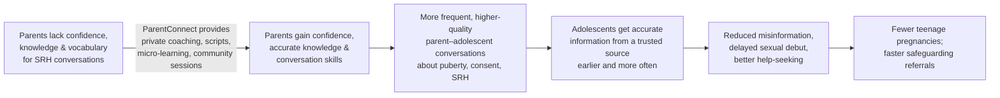

# Product Vision — ParentConnect AI

## Problem statement

Teenage pregnancy is a significant child-protection challenge in Rwanda `[VERIFY: cite national prevalence, e.g. RDHS/NISR]`. SRH education exists in schools and health facilities, but **parents — adolescents' most trusted potential educators — largely lack the confidence, knowledge, and vocabulary** to discuss puberty, relationships, consent, and SRH with their children. Cultural taboos push adolescents toward peers and social media, raising exposure to misinformation, exploitation, and early pregnancy.

The gap is not primarily a lack of clinical facts in the country. It is a **capability and confidence gap at the parent level**, concentrated among caregivers with low literacy, limited connectivity, and no trusted, private, judgement-free place to ask "how do I even start this conversation?"

## Theory of change

**Core assumption of the model:** if parents are equipped and supported, the trusted parent–child channel becomes the primary route for accurate SRH information — more durable and culturally safer than app-to-adolescent delivery. This is why the product invests in *parent capability*, not in talking to adolescents directly.

## Target outcomes

| Horizon | Outcome | How we'll know (indicator) |
|---|---|---|
| Output (pilot) | Parents reached and actively engaged across channels | Registered & active users by channel; module completion |
| Intermediate (pilot) | Measurable rise in parent knowledge & confidence | Baseline→follow-up assessment delta (FR-29) |
| Intermediate (pilot) | Parents actually talk to their adolescents | Self-reported parent–adolescent communication frequency/quality |
| Safeguarding (always) | Disclosures reach the right services fast | Referrals raised → acknowledged → actioned, with SLA adherence |
| Long-term (beyond pilot) | Reduced teenage pregnancy in served areas | Programme/MoH population indicators `[VERIFY: attribution method]` |

Long-term population impact is **not** attributable to a pilot alone; the pilot's honest job is to prove the intermediate outcomes and safe operation.

## What success looks like (pilot)

1. A low-literacy rural caregiver with a basic phone can, in Kinyarwanda, get an accurate, safe answer and a conversation script — and never sees an unsafe medical claim.
2. Every disclosure of abuse/exploitation/suicidal ideation/pregnancy surfaces referral information immediately and, where a human referral is raised, is tracked to closure.
3. Clinical reviewers can point to the exact approved source behind any AI answer.
4. A DPO can confirm no adolescent name or ID is stored anywhere.
5. Programme staff can show funders a credible knowledge/confidence gain, disaggregated by district and channel.

## Explicit non-goals

- **Not** a diagnostic or clinical tool. It never diagnoses, prescribes, or advises on termination (NFR-21).
- **Not** a direct adolescent-facing sex-ed app in the MVP (`[ASSUMPTION]` Q10). It equips *parents*.
- **Not** a general-purpose chatbot. It answers within a curated, approved scope and refuses/escalates outside it.
- **Not** a social network or peer forum (moderation and safeguarding cost would dominate; deferred).
- **Not** training a foundation model. Retrieval-augmented only (ADR-0003).
- **Not** a data-collection instrument for anything beyond its stated M&E purpose. No secondary data uses.
- **Not** a replacement for schools, health facilities, or Isange centres — it routes toward them.

## Guiding principles

- **Safety over capability.** A refusal is a success when the alternative is an unsafe answer.
- **Data minimisation over analytics convenience.** If a field can't be justified, it isn't collected.
- **The offline, low-literacy, no-smartphone user is the primary design target**, not an edge case.
- **Boring, durable technology.** The system must run for years on a small budget.
